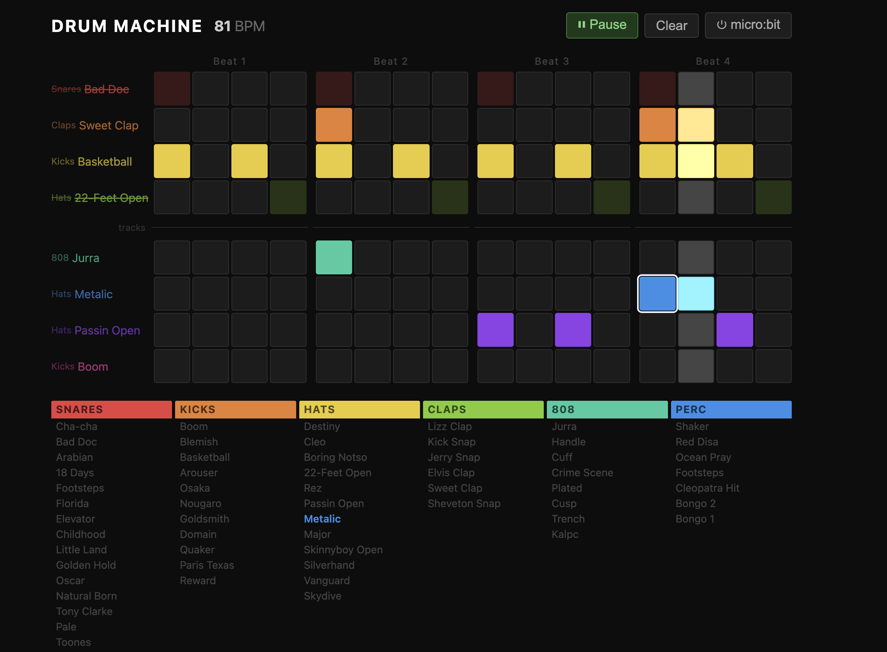
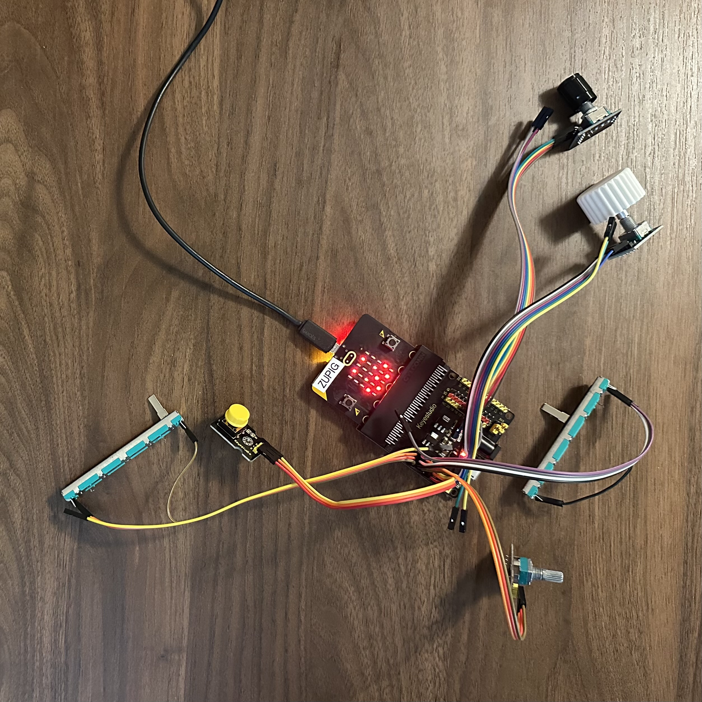
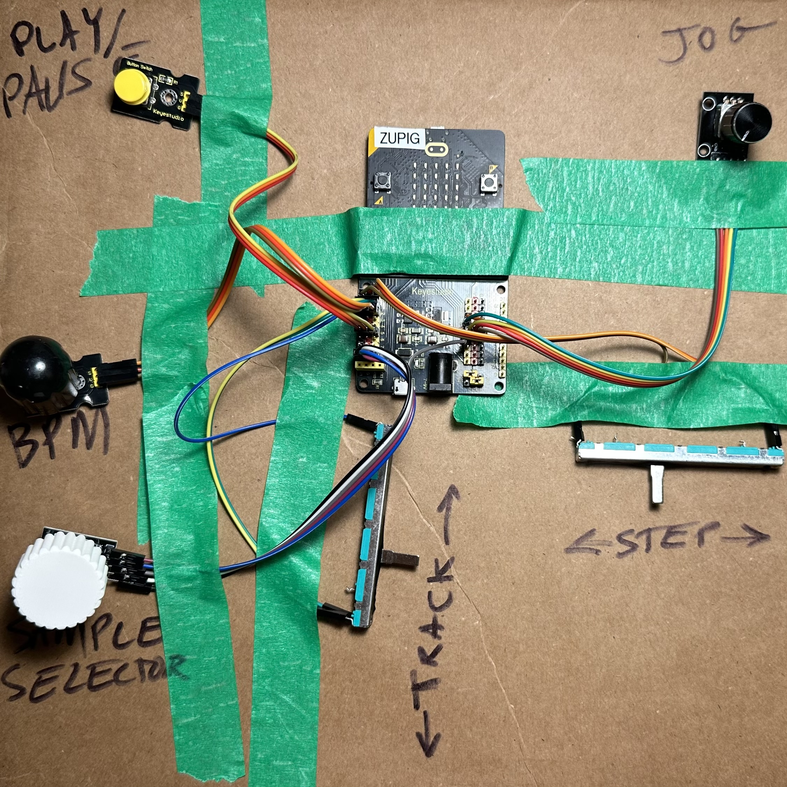
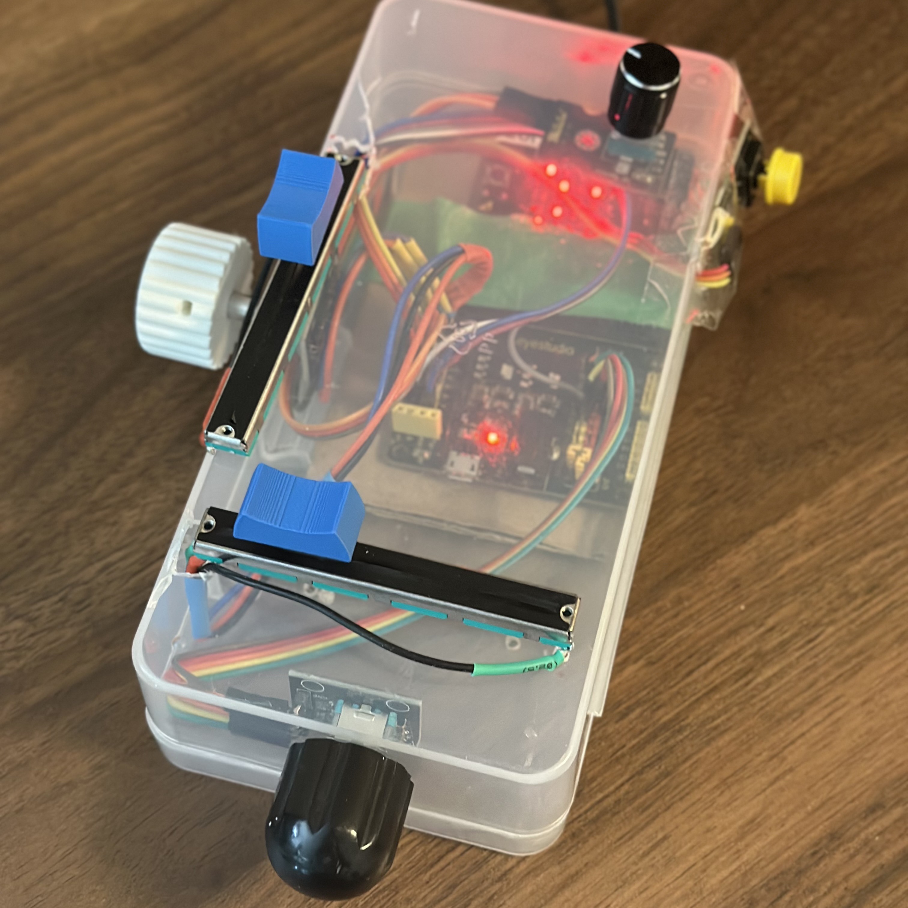

# Tangible Interfaces Drum Machine

This project builds a physical controller for a browser-based drum machine, inspired by classic machines like the Roland 808. Drum machines are the foundation of modern music — from disco to techno. They play short audio samples in repeating loops, letting musicians program rhythms by placing hits at specific moments on a timeline. The iconic "four on the floor" rock beat, for example, is simply a bass drum on every fourth step.

Musicians used these tools to create complex compositions starting in the late 1970s. While synthesizers use a piano keyboard, drum machines have always had a more grid-like interface — and today that grid is usually on a screen. This project brings it back to physical controls.

## How It Works

The project has two parts: a microbit microcontroller and a web page.

The physical controls — sliders, knobs, and a button — connect to the microbit. The microbit reads the control inputs and sends them over a USB serial connection to the web page. The web page displays the drum grid, plays the audio samples, and updates in real time as you turn knobs and move sliders.

<video src="images/drum_machine.mp4" controls width="100%"></video>

# Hardware

- Microbit v2
- Microbit breakout board (speeds up prototyping by making pins easy to wire)
- Sliding potentiometer — **step**: selects the current step on the timeline
- Sliding potentiometer — **track**: selects the current track
- Rotary potentiometer — **tempo**: sets the playback speed in beats per minute, covering a slow-to-fast disco range
- Rotary encoder — **sample**: selects the audio sample for the current track
- Rotary encoder — **jog**: shifts the entire track forward or backward to create rhythmic "swing", or nudges a single selected hit
- Button: play / pause
- Jumper wires with socket ends
- USB cable

## Prototype 1: Loose wires

The first prototype is just the components wired together on a desk. Quick to build and easy to change, but fragile.

## Prototype 2: Taped to cardboard

Taping everything to a piece of cardboard gives the controls a fixed position, making it easier to use while testing.

## Prototype 3: In a box

Mounting the controls in a small box creates something that feels like a finished instrument.

# Microbit Program

The microbit program reads the sliders, knobs, and button, then sends the values as structured messages to the web page over USB serial.

[View the microbit program source](drum_machine.ts)

<!-- tangible-interfaces-project-drum-machine -->

[Open in MakeCode editor](https://makecode.microbit.org/S05362-83625-16605-93381){:target="\_blank"}

# Web Page

[Open the drum machine](drum_machine.html){:target="\_blank"}

The web page shows a 16-step by 8-track grid. Each row is one instrument track, and each column is one step in the rhythmic loop. Clicking a cell toggles whether that instrument plays on that step.

The tracks are split into two groups of four, with a horizontal divider between them. Each track label on the left shows the name of its current sample. A default loop is loaded when the page opens, with at least four active tracks.

Audio samples come from the [1LOVE Vintage Drum Kit](https://freesound.org/people/1LOVE/packs/35238/) on Freesound.org, which is released under a public domain license.

A **Clear** button resets the grid so you can start a new pattern from scratch.
